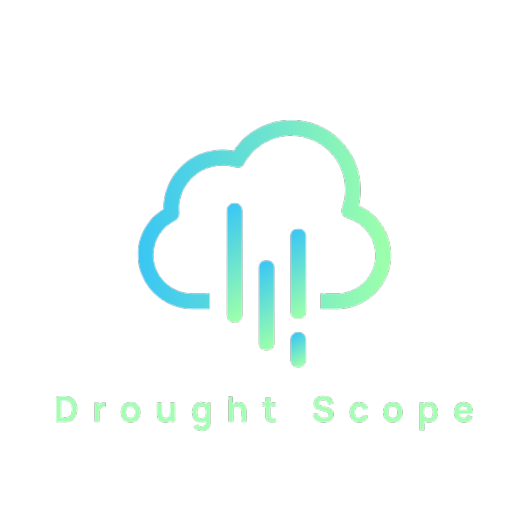

# Drought Scope - Drought Severity Prediction Web App

## Overview

**Drought Scope** is an interactive web application built using Streamlit that predicts drought severity levels based on meteorological and geographic features. The app leverages a pre-trained Random Forest model with feature scaling to classify drought severity into six levels:

- No Drought
- Abnormally Dry
- Moderate Drought
- Severe Drought
- Extreme Drought
- Exceptional Drought

Users can upload their own CSV or Excel datasets containing required features to generate drought predictions, visualize feature importance, and explore feature correlations.

---

## Features

- Upload CSV or Excel file with drought-related features
- Automated data validation and preprocessing
- Drought severity prediction with a Random Forest model
- Interactive filtering of prediction results by drought class
- Visualizations:
  - Feature Importance bar chart
  - Feature Correlation heatmap
- Display of evaluation metrics (accuracy, precision, recall, F1 score) when true labels are provided
- Downloadable prediction results as CSV
- Feedback form in sidebar

---

## Required Columns for Input Data

The input dataset must include the following columns:

['fips', 'PS', 'QV2M', 'T2MDEW', 'T2M_MAX', 'T2M_MIN', 'T2M_RANGE', 'TS',
'WS10M_RANGE', 'WS50M', 'WS50M_RANGE', 'year', 'lat', 'lon', 'GRS_LAND']
